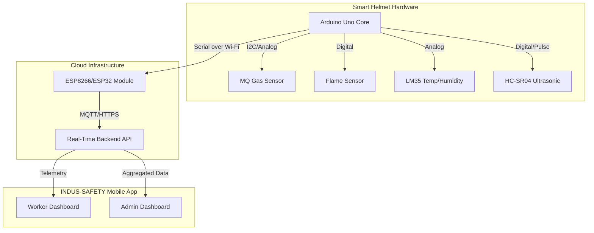

<div align="center">


<br>

[Vision](#-vision) • [Showcase](#-project-gallery) • [Features](#-key-features) • [Tech Stack](#-tech-stack) • [Hardware](#%EF%B8%8F-hardware-ecosystem) • [Deploy](#-getting-started) • [Contact](#-authority--vision)

<br>

<div style="display: flex; justify-content: center; flex-wrap: wrap; gap: 10px;">
  
  
  
  
  
</div>

<br>

[](#-showcase)

<br>

<i>Real-time environmental hazard monitoring and collision detection utilizing IoT telemetry and a cross-platform mobile ecosystem.</i>

</div>

---

## 🔭 Vision

Every year, thousands of industrial accidents occur due to unnoticed environmental hazards and sudden collisions. **INDUS-SAFETY** is an AI-powered smart helmet ecosystem designed to actively monitor surroundings, predict hazards, and alert workers and supervisors in real time.

### 🌟 Engineering Highlights
✔ **Multi-sensor embedded logic** (Gas, Flame, Temp, Ultrasonic) built on C/C++  
✔ **Real-time collision & proximity detection algorithms** to prevent impacts  
✔ **Cross-platform mobile ecosystem** (Worker & Admin dashboards) in Flutter  
✔ **Hardware-to-Cloud telemetry integration** for enterprise-wide monitoring  

---

## 📸 Project Gallery

<div align="center">

| Assembly (Internal) | Assembly (External) |
|:---:|:---:|
|  |  |

| App: Worker Status | App: Admin Dashboard |
|:---:|:---:|
|  |  |

</div>

---

## 🏗️ System Architecture



*(Above: High-level data flow from embedded sensors to real-time mobile application)*

---

## ✨ Key Features

### 🛡️ Comprehensive Environmental Monitoring
- **Toxic Gas Detection:** Alerts workers to the presence of harmful gases or smoke instantly using an MQ-series sensor.
- **Fire Hazard Detection:** Identifies nearby flames using highly sensitive IR fire detectors.
- **Heat Stress Prevention:** Continuously monitors temperature, warning the user before physiological limits are reached.

### 🚨 Collision & Proximity Alerts
- **Spatial Awareness:** Utilizes dual HC-SR04 ultrasonic sensors to detect approaching objects, preventing fatal collisions and accidental strikes.

### 📱 Real-Time Ecosystem ("INDUS-SAFETY" App)
- **Worker View:** A sleek, offline-capable Flutter app displaying live sensor statuses directly to the wearer.
- **Admin Dashboard:** Enables supervisors and safety officers to monitor an entire fleet of helmets simultaneously, ensuring rapid response to any emergent alerts.

---

## 🛠️ Hardware Ecosystem

The core logic of the smart helmet runs on an **Arduino Uno**, strategically wired with the following peripherals:

| Component | Function | Interface / Pin Type |
|-----------|----------|----------------------|
| **Arduino Uno** | Central Processing Unit | Base Control |
| **HC-SR04** | Ultrasonic Proximity & Collision Detection | Digital (Echo/Trig) |
| **MQ Sensor** | Smoke & Hazardous Gas Detection | Analog (A0) |
| **Flame Sensor** | IR Fire Range Detection | Digital |
| **LM35 / DHT** | Temperature & Humidity Readings | Analog (A1) |
| **ESP Module** | Bridges localized data to the Cloud/App network | Serial (TX/RX) |

---

## 💻 Tech Stack

- **Firmware:** C/C++ (Arduino IDE)
- **Mobile Application:** Flutter & Dart (Cross-Platform iOS/Android)
- **Communication Layer:** Serial over Wi-Fi (ESP module) to Firebase / Local Server

---

## 🚀 Getting Started

Follow these instructions to get a copy of the project up and running on your local machine for development and testing.

<details>
<summary><b>1️⃣ Firmware Installation (Arduino)</b></summary>
<br>

1. Navigate to the `arduino_code/smart_helmet/` directory.
2. Open `smart_helmet.ino` using the Arduino IDE.
3. Ensure you have the correct board (**Arduino Uno**) and port selected in the Tools menu.
4. Verify and **Upload** the code to the microcontroller.
</details>

<details>
<summary><b>2️⃣ Mobile App Setup (Flutter)</b></summary>
<br>

1. Ensure you have the [Flutter SDK](https://flutter.dev/docs/get-started/install) installed.
2. Open your terminal and navigate to the flutter app directory:
   ```bash
   cd indus_safety_app
   ```
3. Fetch all required dependencies:
   ```bash
   flutter pub get
   ```
4. Connect a physical device or start an emulator/simulator.
5. Run the application:
   ```bash
   flutter run
   ```
</details>

---

## 🤝 Contributing

Contributions, issues, and feature requests are welcome!  
Feel free to check [issues page](#) if you want to contribute.

---

## 👨‍💻 Authority & Vision

<br>

<div align="center">
  
  <p><em>Aspiring AI Engineer | Architecting Intelligent Systems</em></p>
  
  <br>

  <a href="mailto:sathxsh57@gmail.com">
    
  </a>
  <a href="https://github.com/sathishr-ai">
    
  </a>
  <a href="https://www.linkedin.com/in/sathish-r-2393412a5">
    
  </a>
</div>

---

## 📄 License

This project is licensed under the **MIT License** - see the [LICENSE](LICENSE) file for details.

---
<div align="center">
  <i>Stay Safe, Work Smart. Built with ❤️ for Industrial Safety.</i>
</div>
