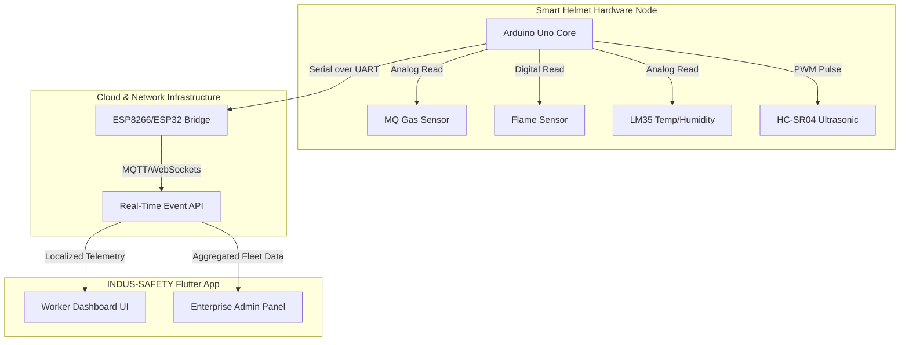

<div align="center">


<br>

<p align="center">
  <b><a href="#-vision">Vision</a></b> • 
  <b><a href="#-project-gallery">Showcase</a></b> • 
  <b><a href="#-key-features">Features</a></b> • 
  <b><a href="#-tech-stack">Tech Stack</a></b> • 
  <b><a href="#%EF%B8%8F-hardware-ecosystem">Hardware</a></b> • 
  <b><a href="#-getting-started">Deploy</a></b> • 
  <b><a href="#-authority--vision">Contact</a></b>
</p>

<br>

<div style="display: flex; justify-content: center; flex-wrap: wrap; gap: 10px;">
  
  
  
  
  
</div>

<br>

[](#-showcase)

<br>

<i>Next-generation environmental hazard monitoring and collision detection utilizing IoT telemetry and a cross-platform Flutter ecosystem.</i>

</div>

---

## 🔭 Vision

Every year, thousands of industrial accidents occur due to unnoticed environmental hazards and sudden collisions. **INDUS-SAFETY** is an AI-powered smart helmet ecosystem designed to actively monitor surroundings, predict hazards, and alert workers & supervisors in real-time, drastically reducing workplace fatalities and injury exposure.

### 🌟 Engineering Highlights
✔ **Multi-sensor embedded logic** (Gas, Flame, Temp, Ultrasonic) built natively on **C/C++**  
✔ **Real-time spatial awareness algorithms** for zero-latency collision prevention  
✔ **Cross-platform mobile client** featuring offline-capable Worker & Admin dashboards  
✔ **Hardware-to-Cloud telemetry** engineering for enterprise-scale safety oversight  

---

## 📸 Project Gallery

<div align="center">

| 🛠️ Internal Embedded Assembly | 📡 External Sensor Layout |
|:---:|:---:|
|  |  |

<br>

| 📱 Worker Monitoring Node | 🛡️ Admin Fleet Dashboard |
|:---:|:---:|
|  |  |

</div>

---

## 🏗️ System Architecture

Our robust IoT architecture guarantees fault-tolerant data transmission from the worker's physical environment right to the supervisor's dashboard.



---

## ✨ Key Features

### 🛡️ Environmental Hazard Intelligence
*   **Toxic Gas Detection:** Alerts workers to the presence of harmful gases, fumes, or smoke instantly using an MQ-series chemical sensor.
*   **Fire Hazard Proximity:** Identifies nearby flames & excessive IR heat before human detection limits using sensitive IR fire detectors.
*   **Heat Stress Prevention:** Continuously logs thermal data, providing haptic or UI warnings before physiological heat limits are reached.

### 🚨 Collision & Proximity Defense
*   **Ultrasonic Spatial Awareness:** Utilizes dual HC-SR04 ultrasonic sensors to map approaching heavy machinery or overhead structures, preventing fatal strikes.

### 📱 Enterprise App Ecosystem
*   **Worker View:** A sleek, dark-mode Flutter app displaying live sensor statuses directly to the wearer. Built for extreme visibility in dark environments.
*   **Admin Dashboard:** Empowers Site Supervisors to monitor an entire fleet of helmets simultaneously. Instant visual and push-notification alerts for an entire site.

---

## 🛠️ Hardware Ecosystem

The localized brain of the INDUS-SAFETY system relies on the **Arduino Uno**, wired specifically for rapid fault detection:

| Component Type | Model | Core Function | Interface Layer |
| :--- | :--- | :--- | :--- |
| **Microcontroller** | Arduino Uno R3 | Central Data Processing | Core Motherboard |
| **Collision Array** | HC-SR04 | Proximity & Strike Prevention | Digital I/O (Echo/Trig) |
| **Chemical Sensor** | MQ Series (MQ-2) | Gas/Smoke Data Logging | Analog (A0) |
| **Flame Detector** | Standard IR Sensor | Direct Fire Range Detection | Digital |
| **Thermal Sensor** | LM35 / DHT11 | Temp & Humidity Streams | Analog (A1) |
| **IoT Bridge** | ESP8266/ESP32 | Wireless Telemetry Feed | Serial (TX/RX) |

---

## 💻 Tech Stack

<div align="center">
  
  
  
  
  
  
</div>

---

## 🚀 Getting Started

Deploying the INDUS-SAFETY system in your local environment.

<details>
<summary><b>🛠️ 1. Firmware Flash (Arduino)</b></summary>
<br>

1. Navigate to the `arduino_code/smart_helmet/` directory.
2. Open `smart_helmet.ino` using the Arduino IDE.
3. Validate that your Board Manager points to **Arduino Uno** and select your COM Port.
4. Verify compilation and click **Upload** to flash the microcontroller.
</details>

<details>
<summary><b>📱 2. Mobile Client Deployment (Flutter)</b></summary>
<br>

1. Ensure your system meets the [Flutter SDK Requirements](https://flutter.dev/docs/get-started/install).
2. Open your bash/terminal and move into the application root:
   ```bash
   cd indus_safety_app
   ```
3. Resolve dart dependencies:
   ```bash
   flutter pub get
   ```
4. Connect an ADB-enabled device or launch the iOS/Android simulator.
5. Build and run the debug client:
   ```bash
   flutter run
   ```
</details>

---

## 🤝 Contributing

We welcome contributions from embedded engineers and mobile developers!  
Check our [issues tracker](#) to see open tickets or submit a pull request.

---

## 👨‍💻 Authority & Vision

<br>

<div align="center">
  
  <p><em>Aspiring AI Engineer | Architecting Intelligent Systems</em></p>
  
  <br>

  <a href="mailto:sathxsh57@gmail.com">
    
  </a>
  <a href="https://github.com/sathishr-ai">
    
  </a>
  <a href="https://www.linkedin.com/in/sathish-r-2393412a5">
    
  </a>
</div>

---

## 📄 License

This repository is governed by the **MIT License** - view the [LICENSE](LICENSE) file for complete details.

---
<div align="center">
  <i>Stay Safe, Work Smart. Built with ❤️ for Industrial Safety.</i>
</div>
