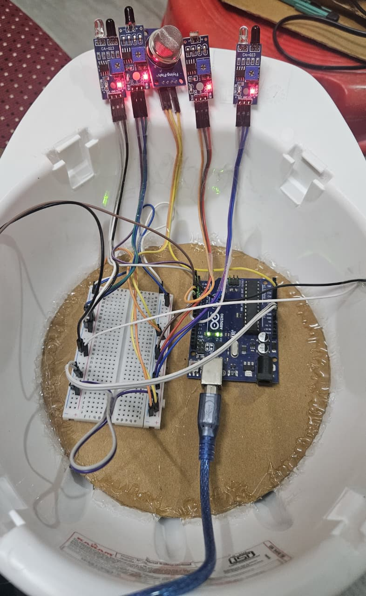
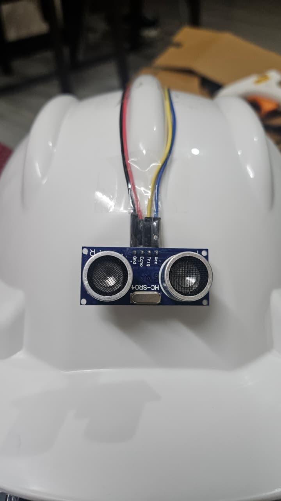
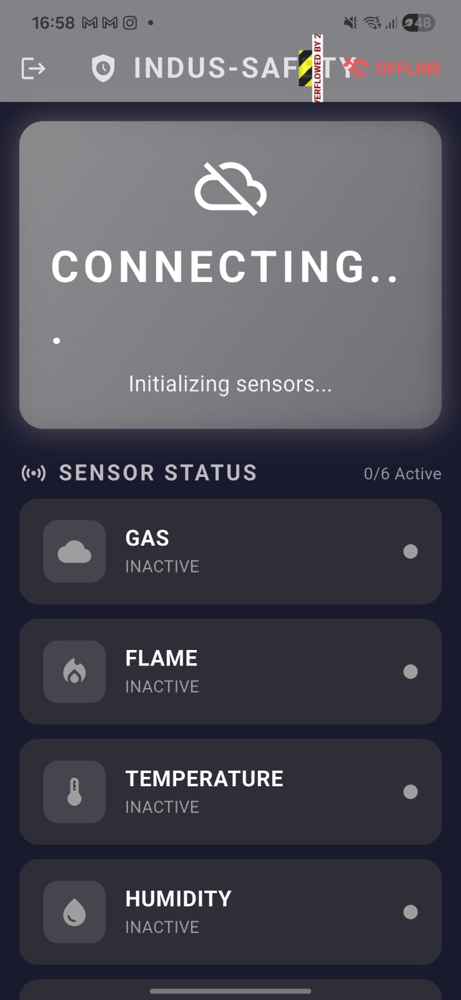
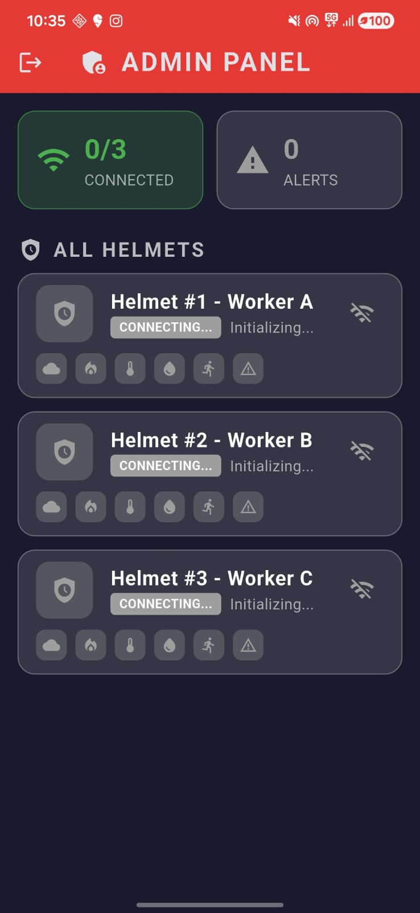

<div align="center">

# 👷‍♂️ AI-Integrated Smart Helmet for Industrial Safety

**A Next-Generation Protection System for the Modern Workforce**

[]()
[]()
[]()
[](https://opensource.org/licenses/MIT)

</div>

---

<p align="center">
  <i>Every year, thousands of industrial accidents occur due to unnoticed environmental hazards and sudden collisions.
  <br>
  <b>INDUS-SAFETY</b> is an AI-powered smart helmet ecosystem designed to actively monitor surroundings, predict hazards, and alert workers and supervisors in real time.</i>
</p>

---

## ✨ Key Features

🛡️ **Comprehensive Environmental Monitoring**
- **Toxic Gas Detection:** Alerts workers to the presence of harmful gases or smoke instantly using an MQ-series sensor.
- **Fire Hazard Detection:** Identifies nearby flames using highly sensitive flame detectors.
- **Heat Stress Prevention:** Continuously monitors temperature and humidity (LM35/DHT), warning the user before physiological limits are reached.

🚨 **Collision & Proximity Alerts**
- **Spatial Awareness:** Utilizes dual HC-SR04 ultrasonic sensors to detect approaching objects, preventing fatal collisions and accidental strikes.

📱 **Real-Time Ecosystem ("INDUS-SAFETY" App)**
- **Worker View:** A sleek, offline-capable Flutter app displaying live sensor statuses directly to the worker.
- **Admin Dashboard:** Enables supervisors and safety officers to monitor an entire fleet of helmets simultaneously, ensuring rapid response to any emergent alerts.

---

## 🛠️ Hardware Ecosystem

The core logic of the smart helmet runs on an **Arduino Uno**, strategically wired with the following peripherals:

| Component | Function |
|-----------|----------|
| **Arduino Uno** | Central Processing Unit |
| **HC-SR04** | Ultrasonic Proximity & Collision Detection |
| **MQ Sensor** | Smoke & Hazardous Gas Detection |
| **Flame Sensor** | IR Fire Range Detection |
| **LM35 / DHT** | Temperature & Humidity Readings |
| **ESP8266/ESP32** *(Wi-Fi Module)* | Bridges localized data to the Cloud/App network |

---

## 💻 Tech Stack

- **Firmware:** C/C++ (Arduino IDE)
- **Mobile Application:** Flutter & Dart (Cross-Platform iOS/Android)
- **Communication Layer:** Serial over Wi-Fi (ESP module) to Firebase / Local Server

---

## 📸 Project Gallery

<div align="center">

| Assembly (Internal) | Assembly (External) |
|:---:|:---:|
|  |  |

| App: Worker Status | App: Admin Dashboard |
|:---:|:---:|
|  |  |

*(Place your images in the `assets/` folder with these names!)*
</div>

---

## 🚀 Getting Started

Follow these instructions to get a copy of the project up and running on your local machine for development and testing.

### 1️⃣ Firmware Installation (Arduino)
1. Navigate to the `arduino_code/smart_helmet/` directory.
2. Open `smart_helmet.ino` using the Arduino IDE.
3. Ensure you have the correct board (Arduino Uno) and port selected.
4. Verify and **Upload** the code to the microcontroller.

### 2️⃣ Mobile App Setup (Flutter)
1. Ensure you have the [Flutter SDK](https://flutter.dev/docs/get-started/install) installed.
2. Open your terminal and navigate to the flutter app directory:
   ```bash
   cd indus_safety_app
   ```
3. Fetch all required dependencies:
   ```bash
   flutter pub get
   ```
4. Connect a physical device or start an emulator/simulator.
5. Run the application:
   ```bash
   flutter run
   ```

---

## 🤝 Contributing

Contributions, issues, and feature requests are welcome!  
Feel free to check [issues page](#) if you want to contribute.

---

## 📄 License

This project is licensed under the **MIT License** - see the [LICENSE](LICENSE) file for details.

---
<div align="center">
  <i>Stay Safe, Work Smart. Built with ❤️ for Industial Safety.</i>
</div>
